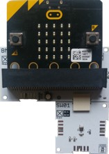

# XinaBox SW02 MakeCode extension

This library provides functions to access environmental data from the [XinaBox SW02](https://xinabox.cc/products/sw02).



[Read more about it or purchase one here](https://xinabox.cc/products/sw02)

The SW02 uses a Bosch BME280 to report:
* temperature 
* humidity 
* atmospheric pressure.

This library provides functions that give you access to these variables, as well some measures that can be derived from them:
* dewpoint
* altitude

There are 3 other functions:
* power on/off
* set I2C address

## ~ hint

By default the SW02 power is ON, and the I2C address is set correctly (to 0x76).
You do NOT need to power on the SW02 or set the I2C address to use it

## ~


## How-to guides:

A comprehensive set of How-to guides that show you how to use the blocks is available online:
[XinaBox How-to guides for the SW02 on BBC micro:bit using MakeCode](https://drive.google.com/open?id=1_oNXhgYeW0AHTLmRxomowxPdvNBCi0iS)


## Core functions: Temperature:

```blocks
// Show the temperature in Celcius on the micro:bit 5x5 LED matrix:
basic.showNumber(SW02.temperature(BME280_T.T_C))

// Show the temperature in Celcius on the micro:bit 5x5 LED matrix:
basic.showNumber(SW02.temperature(BME280_T.T_F))

```


## Core functions: Humidity:

```blocks
// Show the relative humidity (as a percentage) on the micro:bit 5x5 LED matrix:
basic.showNumber(SW02.humidity())

```

## Core functions: Atmospheric pressure:

```blocks
// Show the atmospheric pressure in Pascal on the micro:bit 5x5 LED matrix:
basic.showNumber(SW02.pressure(BME280_P.Pa))

// Show the atmospheric pressure in HectoPascals (Pascals / 100) on the micro:bit 5x5 LED matrix:
basic.showNumber(SW02.pressure(BME280_P.hPa))

```

## Attribution:
The library is based on [BME280 Package from microbit/micropython Chinese community](https://github.com/makecode-extensions/BME280). 

Thanks also to Shaoziyang for all the heavy lifting :)
  


## License:

MIT

Copyright (c) 2019, XinaBox Limited

## Supported targets:

* PXT/microbit
* PXT/CC03
* PXT/CS11
* PXT/CW03


